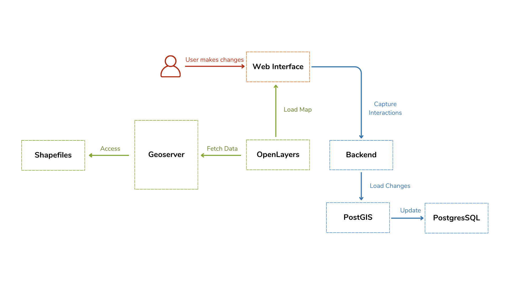

# 🌍 OpenLayers Geospatial Project

Welcome to the **OpenLayers Geospatial Project**! This repository provides all the necessary components for visualizing, managing, and interacting with geospatial data using **OpenLayers**, **GeoServer**, and **PostgreSQL/PostGIS**.

---

## 📚 Table of Contents

- [🚀 Project Overview](#-project-overview)
- [📂 Project Architecture](#-project-architecture)
- [🛠 Prerequisites](#-prerequisites)
- [📦 Installation and Setup](#-installation-and-setup)
  - [1. PostgreSQL and PostGIS Setup](#1-postgresql-and-postgis-setup)
  - [2. GeoServer Configuration](#2-geoserver-configuration)
  - [3. Backend Server Setup](#3-backend-server-setup)
  - [4. OpenLayers Client Setup](#4-openlayers-client-setup)
- [📂 JS Files](#-js-files)
  - [🗺 osm.js](#-osmjs)
  - [🌍 geoserver.js](#-geoserverjs)
  - [🌐 osm_gs.js](#-osm-gsjs)
- [📋 How It Works](#-how-it-works)
- [📸 Web Interface](#-web-interface)
- [👥 Contribution](#-contribution)
- [📄 Project By](#-project-by)

---

## 🚀 Project Overview

This project enables you to:

1. **Visualize Geospatial Layers**: Display maps and spatial data interactively using **OpenLayers**.
2. **Manage Geospatial Data**: Publish, query, and update geospatial data through **GeoServer** and **PostgreSQL/PostGIS**.
3. **Serve Data Efficiently**: Leverage Web Map Service (WMS) or Web Feature Service (WFS) to exchange data seamlessly.

---

## 📂 **Project Architecture**



## 🛠 Prerequisites

| Tool                     | Main Role                                     | Primary Interaction                                      |
| ------------------------ | --------------------------------------------- | -------------------------------------------------------- |
| **PostgreSQL + PostGIS** | Robust geospatial database                    | Stores and queries geospatial data                       |
| **GeoServer**            | GIS server for publishing geospatial services | Publishes data via WMS/WFS for OpenLayers                |
| **OpenLayers**           | Map display and user interaction              | Consumes GeoServer services and sends geometries via API |
| **HTML/CSS/JavaScript**  | Web application design and styling            | User interface for data manipulation                     |
| **SHP (Shapefile)**      | Geospatial data format                        | Source or output for PostgreSQL/PostGIS or ArcMap        |
| **npm and Node.js**      | Required to run the backend server            | Enables middelware backend functionality                 |

---

## 📦 Installation and Setup

### 1. PostgreSQL and PostGIS Setup (For Windows)

1. **Install PostgreSQL**:

   - Download PostgreSQL for Windows from the [official website](https://www.postgresql.org/download/windows/).
   - Follow the installation wizard and select **PostGIS** during the setup.

2. **Create a Database for Geospatial Data**:

   - Open **pgAdmin** and connect to your PostgreSQL server.
   - Create a new database and add the **PostGIS extension**:
     ```sql
     CREATE DATABASE spatial_data;
     \c spatial_data
     CREATE EXTENSION postgis;
     ```

3. **Configure Database Credentials**:
   - Modify the `server` code (e.g., `service.js`) to use your PostgreSQL connection details.
4. **Ensure PostgreSQL is running and set up a database to store your geospatial data.**

---

### 2. GeoServer Configuration

1. **Install GeoServer**:

   - Download GeoServer from [geoserver.org](https://geoserver.org/).
   - Follow the installation instructions for your operating system.

2. **Create a New Layer**:

   - Access the GeoServer web interface (`http://localhost:8080/geoserver`).
   - Add a **data store** connection (e.g., PostgreSQL database).
   - Create a **new layer** by importing data from your database or uploading a file (e.g., a shapefile).

   **Layers to be fetched from the GeoServer instance**:

   - **gis_osm_landuse_a_free_1**
   - **gis_osm_roads_free_1**
   - **gis_osm_pois_free_1**
   - **gis_osm_places_free_1**
   - **civ_adm1, civ_adm2, civ_adm3**
   - **point_shapes, line_shapes, polygon_shapes**

   Ensure these layers are configured and publicly accessible from GeoServer.

   **GeoServer layer creation interface:**

   

3. **Configure Styles**:

   - Use **SLD** (Styled Layer Descriptor) files to define the appearance of your layers. This allows you to customize the display styles of each layer to suit your preferences.

4. **Test the Services**:
   - Verify that the **WMS** (Web Map Service) and **WFS** (Web Feature Service) endpoints are functioning correctly by testing the services through the GeoServer web interface.

---

### 3. Backend Server Setup

1. **Navigate to the Server Directory**:

   ```bash
   cd server
   ```

2. **Install Dependencies and Start the Server**:

   ```bash
   npm install
   node service.js
   ```

   The server will act as middleware, connecting the **PostgreSQL** database and **GeoServer** to the **OpenLayers** client.

---

### 4. OpenLayers Client Setup

1. **Visualizing Layers with OpenLayers 🎯**

   The client implementation uses **JavaScript**, **CSS**, and **HTML** with the **OpenLayers** library to fetch layers from the **GeoServer** WMS service and display them interactively. You can customize the map interface to show geospatial data, allowing users to interact with and explore the spatial layers.

2. **Integration Steps**:

   - Link your **WMS** endpoints from **GeoServer** to the **OpenLayers** map object in your client code.
   - Customize the interface to include interactive features like zooming, panning, and querying the layers.

3. **Host the Client**:
   - Deploy your **OpenLayers** map on a **local** or **remote** web server for public or internal access.

### How it works:

- **Fetching Data**:
  OpenLayers can request geospatial data (e.g., layers, points, lines, polygons) from a GeoServer instance via standard web services like WMS (Web Map Service) or WFS (Web Feature Service). It does this by making HTTP requests to GeoServer, which then returns the data, typically in formats like GeoJSON, GML, or KML.

- **Displaying Data:**
  OpenLayers takes this data and displays it on the map in the web application. It can render vector data (like points, lines, and polygons) or raster data (like satellite imagery or maps).

---

## 📂 **JS Files**

### 🗺 **osm.js**

Integrates **OpenStreetMap** as a base map with **GeoServer** layers. Supports interaction with custom shape layers (Points, Lines, Polygons) and includes drawing functionality to add features to the map and store their coordinates.

### 🌍 **geoserver.js**

Configures **OpenLayers** to interact with **GeoServer**’s WMS service. Displays layers like **Land Use**, **Roads**, **POIs**, **Places**, and **Administrative Boundaries** (adm1, adm2, adm3). Includes a **layer switcher** to control visibility.

### 🌐 **osm_gs.js**

Combines **OpenStreetMap** with **GeoServer** layers, similar to **geoserver.js**, but also includes additional layers for custom shapes such as **Point**, **Line**, and **Polygon**. Allows users to draw shapes and save coordinates (points, circles, lines, polygons), which are stored in the `drawnFeatures` variable.

---

## How it Works 🌍

This system allows users to interact with geospatial data through a web interface. Here's how it works:

1. **Frontend (OpenLayers & Web App)** 🌐:  
   Users interact with a map using OpenLayers to draw points, lines, or polygons. These actions generate geospatial data.

2. **Backend (API & Database)** 💻:  
   The frontend sends the data to the backend **node.js**, which processes and stores it in a **PostgreSQL** database with **PostGIS** for efficient geospatial management.

3. **PostgreSQL/PostGIS** 🗄️:  
   Geospatial data is stored and queried in PostgreSQL with the PostGIS extension, supporting various geospatial operations.

4. **GeoServer** 🌐:  
   **GeoServer** can serve the data via WMS/WFS, which can be used by OpenLayers to display the data.

This system integrates these components to collect, store, and visualize geospatial data in a web app. 🌍📊

---

## 📸 Web Interface

1. **Interactive Map with OpenLayers**

   

2. **Displaying Shapes from the Database**

   

3. **Zoomed-in View of a Local Position**

   

4. **Displaying the Global View of the Map**

   

---

## 👥 Contribution

We welcome contributions! To contribute:

1. Fork the repository.
2. Create a feature branch.
3. Submit a pull request describing your changes.

---

## **🧑‍💻 Project By**

<a href="https://github.com/AnasBenAmor10/OpenLayers_Geospatial_Project/graphs/contributors">
    
</a>

---
